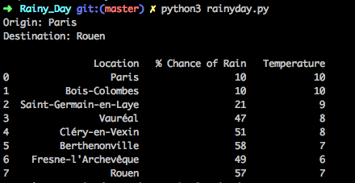
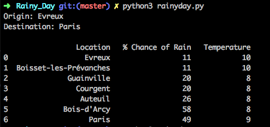
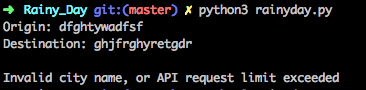
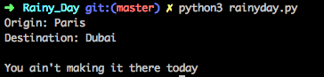
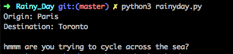

# RainyDay

When planning a cycle trip for the day, I want to find out what the weather is going to be like.
<br />
However, to do this I have to calculate when I will be where, then look up the weather at multiple locations along my route,
inevitably this is inefficient.

I built an automated weather forcast for a specified route.
<br />
It returns the weather every hour at the location I'll be along the route, easy!

## Getting Started

Clone this repo.
<br>
```git clone https://github.com/dfinnis/RainyDay.git; cd RainyDay```

Download dependencies.
<br>
```pip install -r requirements.txt```

Run.
<br>
```python3 rainyday.py```

Then specify origin and destination when prompted.


## Examples





### Protections

I protected against invalid city names:



I protected against problems associated with cycling too far in a day:



I also protected against problems associated with cycling across large bodies of water:




## Approach

Using API requests it's possible to first find the latitude and longitude for a given origin and destination.
<br />
Then [yournavigation.org](http://yournavigation.org) returns the route and travel time between origin and destination.
<br />
The travel time informs how many hourly 'stops' are necessary.
<br />
The location along the route each hour can be found, then finaly the weather on location at the correct time.


### API requests

BTW: There are only 50 API requests per day available. To get a new API key: register for a free account with [accuweather](https://developer.accuweather.com/), follow the directions, add an app, and replace the API key in rainyday.py.

Ride safe and stay dry!
